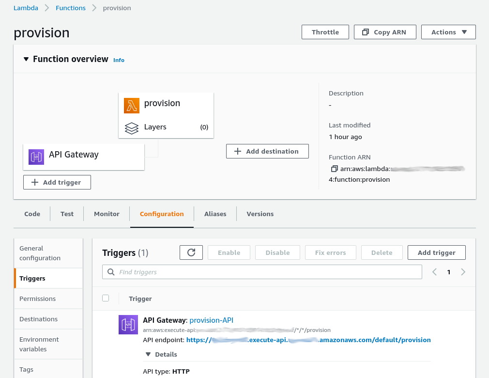

# AWS Lambda for IoT Device Provisioning

This Lambda function allows you to provision and synchronize a balena device with AWS IoT Core in a secure and automated way via an HTTP endpoint. The Lambda may be called by a balena device, as seen in the [cloud-relay](https://github.com/balena-io-examples/cloud-relay) example.

| Method | Actions |
|-------------|--------|
| POST | Provisions a balena device with IoT Core. First the function verifies the device UUID with balenaCloud. Then it creates a public key certificate, attaches a security policy, and registers an AWS Thing for the device. Finally the function pushes identifiers for these entities to balena device environment variables. |
| DELETE | Removes the AWS Thing and certificate for the balena device and removes the balena device environment variables. Essentially reverses the actions from provisioning with POST. |

## Setup and Testing
### AWS setup
These instructions assume you are somewhat familiar with AWS IoT. If not, AWS provides some focused, easy to follow documentation to help you get started. See the page, [Set up your AWS account](https://docs.aws.amazon.com/iot/latest/developerguide/setting-up.html).

#### IoT Core
You must define an AWS IoT policy that describes the permissible messaging operations between IoT Core and a balena device, and provide its name as the AWS_IOT_POLICY variable in the table below. Provisioning attaches the public key certificate created for a device to this policy.

See the documentation, [Create AWS IoT resources](https://docs.aws.amazon.com/iot/latest/developerguide/create-iot-resources.html) for steps to follow. Also see an example `doc/policy.json` and a [screenshot](doc/iot-messaging-policy.png). Your AWS account ID is available from the IAM dashboard.

#### Lambda role
You also must define an AWS IAM Role with permissions to execute the Lambda function as shown in the AWS_ROLE_ARN entry in the table below. See the documentation, [AWS Lambda execution role](https://docs.aws.amazon.com/lambda/latest/dg/lambda-intro-execution-role.html), and specifically the section, *Creating an execution role in the IAM console*. When creating the role, use the "Lambda" use case, which allows a Lambda function to assume the role. Also see example screenshots of the [Permissions](doc/iam-role-permissions.png) and [Trust relationships](doc/iam-role-trust.png) tabs.

### Development setup
First clone the [balena-io-examples/aws-iot-provision](https://github.com/balena-io-examples/aws-iot-provision) repository. Then install the [node-lambda](https://www.npmjs.com/package/node-lambda) tool for local testing and deployment to AWS Lambda. It's simplest to install it globally:

```
   npm install -g node-lambda
```

You will provide the environment variables below in files used by node-lambda. We include example files to help you get started.

| Variable    |    Value    |
|-------------|-------------|
| AWS_ACCESS_KEY_ID | For IAM User with permissions policies to deploy the Lambda function |
| AWS_SECRET_ACCESS_KEY | For access key |
| AWS_REGION | AWS region for registry, like `us-east-1` |
| AWS_IOT_POLICY | Name of AWS policy with permissions for messaging with IoT Core |
| AWS_ROLE_ARN | For IAM Role to execute the Lambda. This role must include the `AWSIoTLogging` and `AWSIoTConfigAccess` permissions policies. |
| BALENA_API_KEY | for use of balena API; found in balenaCloud dashboard at: `account -> Preferences -> Access tokens` |

### HTTP API
The HTTP endpoint expects a request containing a JSON body with the attributes below. Use POST to add a device to the cloud registry, DELETE to remove.

| Attribute | Value |
|-----------|-------|
| uuid | UUID of device  |
| balena_service | (optional) Name of service container on balena device that uses provisioned key and certificate, for example `cloud-relay`. If defined, creates service level variables; otherwise creates device level variables. Service level variables are more secure. |

### Test locally
To test the Lambda function without deploying it, see `tools/test-local.sh`. The comments for that file include instructions on how to use it. You must provide environment variables from the table above in a file with contents like `tools/run.env`.

After a successful POST, you should see the device appear in your IoT Core registry, and `AWS_CERT` and `AWS_PRIVATE_KEY` variables appear in balenaCloud for the device. After a successful DELETE, those variables disappear.

## Deploy
To deploy to AWS Lambda, see `tools/deploy-func.sh`.The comments for that file include instructions on how to use it. You must provide environment variables from the table above in a file with contents like `tools/.env` to deploy the function to AWS Lambda. You also must provide the balena specific environment variables in a separate `tools/deploy.env` file, which are used when running the Lambda function.

After deployment, login to the AWS console and visit the Lambda console for your Lambda function. Next add an API Gateway trigger from the link on that page. The API type is HTTP, and Security is open (though you could add this later). The result should be a Lambda and API Gateway like below.



### Test the Lambda
To test the Lambda, see `tools/test-remote.sh`. You must update the script to provide a balena device UUID and the URL for the API endpoint you created in the Lambda console. Execution of the script requires a POST/DELETE parameter.

After a successful POST, you should see the device appear in your IoT Core registry and `AWS_CERT` and `AWS_PRIVATE_KEY` variables appear in balenaCloud for the device. After a successful DELETE, those variables disappear.
