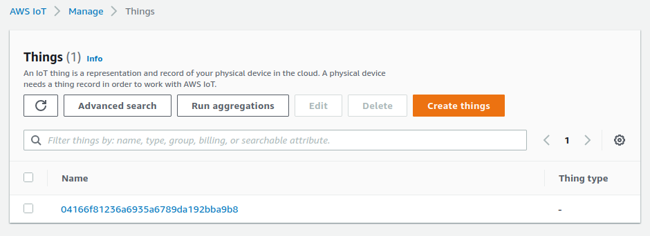

# AWS Lambda for IoT Device Provisioning

This Lambda function allows you to provision and synchronize a balena device with AWS IoT Core in a secure and automated way via an HTTP endpoint. The endpoint may be called by a balena device, as seen in the [cloud-relay](https://github.com/balena-io-examples/cloud-relay) example.

| Method | Actions |
|-------------|--------|
| POST | Provisions a balena device with IoT Core. First the function verifies the device UUID with balenaCloud. Then it creates a public key certificate, attaches a security policy, and registers an AWS Thing for the device. Finally the function pushes identifiers for these entities to balena device environment variables. |
| DELETE | Removes the AWS Thing and certificate for the balena device and removes the balena device environment variables. Essentially reverses the actions from provisioning with POST. |

These instructions describe how to setup your AWS infrastructure for device provisioning, including tools to deploy and test the Lambda function and HTTP endpoint.

## Setup and Testing
### AWS setup
We assume you are somewhat familiar with AWS IoT. If not, AWS provides some focused, easy to follow documentation to help you get started. See the page, [Set up your AWS account](https://docs.aws.amazon.com/iot/latest/developerguide/setting-up.html).

#### IoT Core
You must define an AWS IAM policy that allows your device to connect to IoT Core and publish MQTT messages. At runtime, provisioning attaches the public key certificate created for a device to this policy.

See the documentation, [Create AWS IoT resources](https://docs.aws.amazon.com/iot/latest/developerguide/create-iot-resources.html#create-iot-policy) for steps to follow. The result must allow the actions shown for the AWS_IOT_POLICY entry in the table below, like this [screenshot](doc/iot-messaging-policy.png). Your AWS account region and ID for the policy resource ARN are available in the dropdowns at the top right of the web page.

#### Lambda role
You also must define an AWS IAM Role for the HTTP gateway endpoint to execute the Lambda function. See the documentation, [AWS Lambda execution role](https://docs.aws.amazon.com/lambda/latest/dg/lambda-intro-execution-role.html#permissions-executionrole-console). When creating the role, use the "Lambda" use case, which allows the HTTP endpoint to assume the role for a Lambda function. Also use the specific permissons policies shown for the AWS_ROLE_ARN entry in the table below. See example screenshots of the [Permissions](doc/iam-role-permissions.png) and [Trust relationships](doc/iam-role-trust.png) tabs.

### Tools setup
We provide command line tools to deploy and test the Lambda function and HTTP endpoint. These tools must identify your account, policies, and so on to execute, as shown in the table below. Follow the steps below to create a workspace and define these values.

The setup depends on a Mac/Linux/WSL command line and NodeJS, which is easy to install with the [nvm](https://github.com/nvm-sh/nvm#installing-and-updating) utility.

```
# get the Lambda code and tools
git clone https://github.com/balena-io-examples/aws-iot-provision.git source

# create workspace
cp source/tools/template.env tools.env
cp source/tools/setup-tools.sh .

# edit tools.env to provide the values in the table below

# prepare tools
./setup-tools.sh
```

| Variable    |    Value    |
|-------------|-------------|
| AWS_ACCESS_KEY_ID | For IAM User to run/deploy the Lambda. This user must include the `AWSLambda_FullAccess` and `AWSIoTConfigAccess` policies. See AWS IAM console  *Users -> Security Credentials* to create an access key. |
| AWS_SECRET_ACCESS_KEY | For access key |
| AWS_REGION | AWS region for registry, like `us-east-1` |
| AWS_IOT_POLICY | Name of IAM policy with `iot:Connect` and `iot:Publish` permissions for device messaging to IoT Core |
| AWS_ROLE_ARN | For IAM Role to execute the Lambda. This role must include the `AWSIoTLogging` and `AWSIoTConfigAccess` permissions policies. |
| BALENA_API_KEY | for use of balena API; found in balenaCloud dashboard at: *account -> Preferences -> Access tokens* |

### Test locally
To test the Lambda function without deploying it, run this command in the workspace you created:

```
# UUID must be for a valid device or 'test-provision'
# <method> is POST or DELETE

./test-local.sh [-u UUID] <method>
```

After a successful POST, you should see the device appear as a Thing in your IoT Core registry like the screenshot below, as well as its public key certificate. If using a valid UUID, the corresponding `AWS_CERT` and `AWS_PRIVATE_KEY` variables appear in balenaCloud for the device. After a successful DELETE, those variables disappear.



## Deploy
To deploy to AWS Lambda, run this command in the workspace you created:

```
./deploy-func.sh
```

After deployment, visit the AWS Lambda console, and you should see an entry in the list of functions.

### Create HTTP endpoint
On the console page for your function, you must create an API Gateway trigger (HTTP endpoint) from the `Add trigger` link in the *Function overview* section. See the [screenshot](doc/lambda-create-trigger.png) for the settings.

The result should be a Lambda and API Gateway like below.


### Test the Lambda
To test the Lambda installed on AWS, run this command in the workspace you created:

```
# UUID must be for a valid device or 'test-provision'
# <method> is POST or DELETE
# <provision_url> is for the API Gateway HTTP endpoint

./test-remote.sh [-u UUID] <method> <provision_url>
```

After a successful POST, you should see the device appear in your IoT Core registry. If using a valid UUID, `AWS_CERT` and `AWS_PRIVATE_KEY` variables appear in balenaCloud for the device. After a successful DELETE, those variables disappear.
