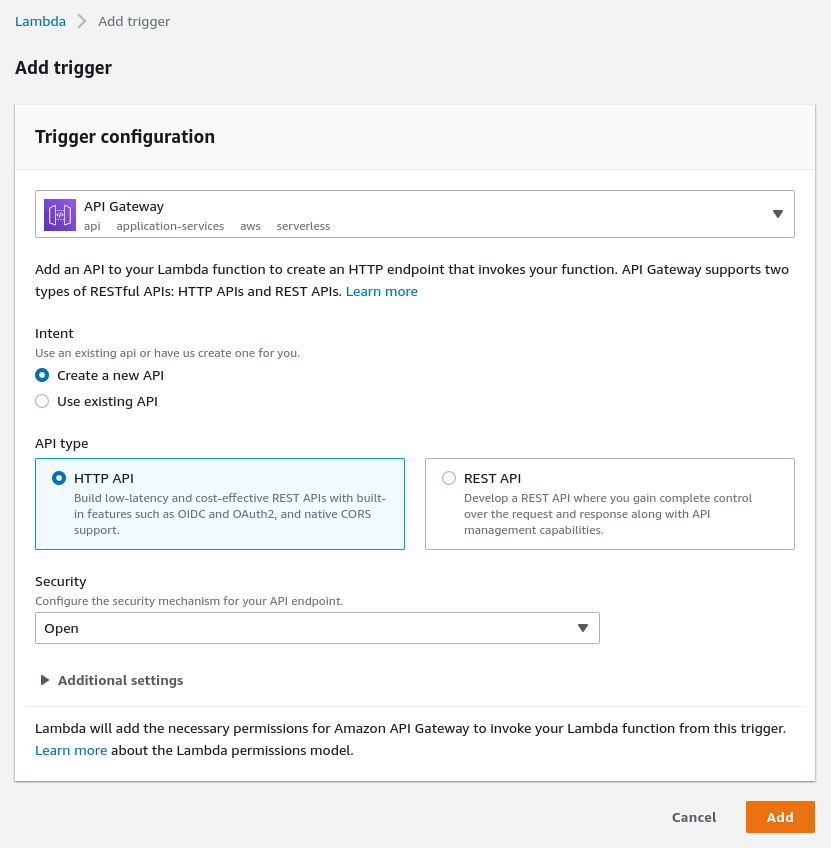

# AWS Lambda for IoT Device Provisioning

This Lambda function allows you to provision and synchronize a balena device with AWS IoT Core in a secure and automated way via an HTTP endpoint. The Lambda may be called by a balena device, as seen in the [cloud-relay](https://github.com/balena-io-examples/cloud-relay) example.

| Method | Actions |
|-------------|--------|
| POST | Provisions a balena device with IoT Core. First the function verifies the device UUID with balenaCloud. Then it creates a public key certificate, attaches a security policy, and registers an AWS Thing for the device. Finally the function pushes identifiers for these entities to balena device environment variables. |
| DELETE | Removes the AWS Thing and certificate for the balena device and removes the balena device environment variables. Essentially reverses the actions from provisioning with POST. |

## Setup and Testing
### AWS setup
These instructions assume you are somewhat familiar with AWS IoT. If not, AWS provides some focused, easy to follow documentation to help you get started. See the page, [Set up your AWS account](https://docs.aws.amazon.com/iot/latest/developerguide/setting-up.html).

#### IoT Core
You must define an AWS IoT policy that allows your device to connect to IoT Core and publish MQTT messages. Later you will use the policy name for the AWS_IOT_POLICY variable in the table below. At runtime, provisioning attaches the public key certificate created for a device to this policy.

See the documentation, [Create AWS IoT resources](https://docs.aws.amazon.com/iot/latest/developerguide/create-iot-resources.html#create-iot-policy) for steps to follow. Also see an example [doc/policy.json](doc/policy.json) and a [screenshot](doc/iot-messaging-policy.png). Your AWS account region and ID for the policy resource ARN are available in the dropdowns at the top right of the web page.

#### Lambda role
You also must define an AWS IAM Role for the HTTP gateway endpoint to execute the Lambda function. See the documentation, [AWS Lambda execution role](https://docs.aws.amazon.com/lambda/latest/dg/lambda-intro-execution-role.html#permissions-executionrole-console). When creating the role, use the "Lambda" use case, which allows the HTTP endpoint to assume the role for a Lambda function. Also use the specific permissons policies shown for the AWS_ROLE_ARN entry in the table below.  Also see example screenshots of the [Permissions](doc/iam-role-permissions.png) and [Trust relationships](doc/iam-role-trust.png) tabs.

### Development setup
Next we will verify that our AWS configuration works locally before deploying it. We will use NodeJS based development tools. First clone the [aws-iot-provision](https://github.com/balena-io-examples/aws-iot-provision) repository. Then install the [node-lambda](https://www.npmjs.com/package/node-lambda) tool for local testing and deployment to AWS Lambda. It's simplest to install it globally:

```
   npm install -g node-lambda
```

You will provide the environment variables below in files used by node-lambda. We include example files to help you get started.

| Variable    |    Value    |
|-------------|-------------|
| AWS_ACCESS_KEY_ID | For IAM User to run/deploy the Lambda. This user must include the `AWSLambda_FullAccess` and `AWSIoTConfigAccess` policies. See AWS IAM console  *Users -> Security Credentials* to create an access key. |
| AWS_SECRET_ACCESS_KEY | For access key |
| AWS_REGION | AWS region for registry, like `us-east-1` |
| AWS_IOT_POLICY | Name of AWS IoT Core policy with permissions for device messaging to IoT Core |
| AWS_ROLE_ARN | For IAM Role to execute the Lambda. This role must include the `AWSIoTLogging` and `AWSIoTConfigAccess` permissions policies. |
| BALENA_API_KEY | for use of balena API; found in balenaCloud dashboard at: *account -> Preferences -> Access tokens* |

### HTTP API
The HTTP endpoint expects a request containing a JSON body with the attributes below. Use POST to add a device to the cloud registry, DELETE to remove.

| Attribute | Value |
|-----------|-------|
| uuid | UUID of device  |
| balena_service | (optional) Name of fleet service container on balena device that uses provisioned key and certificate, for example `cloud-relay`. If defined, creates service level variables; otherwise creates device level variables. Service level variables are more secure. |

### Test locally
To test the Lambda function without deploying it, see `tools/test-local.sh`. The comments for that file include instructions on how to use it. You must provide environment variables from the table above in a file with contents like `tools/run.env`.

After a successful POST, you should see the device appear in your IoT Core registry, and `AWS_CERT` and `AWS_PRIVATE_KEY` variables appear in balenaCloud for the device. After a successful DELETE, those variables disappear.

## Deploy
To deploy to AWS Lambda, see `tools/deploy-func.sh`.The comments for that file include instructions on how to use it. You must provide environment variables from the table above in a file with contents like `tools/.env` to deploy the function to AWS Lambda. You also must provide the balena specific environment variables in a separate `tools/deploy.env` file, which are used when running the Lambda function.

After deployment, login to AWS and visit the Lambda console for your function. Next create an API Gateway trigger from the link in the *Function overview* section on that page. See the screenshot below for the settings.



The result should be a Lambda and API Gateway like below.


### Test the Lambda
To test the Lambda installed on AWS, see `tools/test-remote.sh`. You must update the script to provide a balena device UUID and the URL for the API endpoint you created in the Lambda console.

After a successful POST, you should see the device appear in your IoT Core registry and `AWS_CERT` and `AWS_PRIVATE_KEY` variables appear in balenaCloud for the device. After a successful DELETE, those variables disappear.
